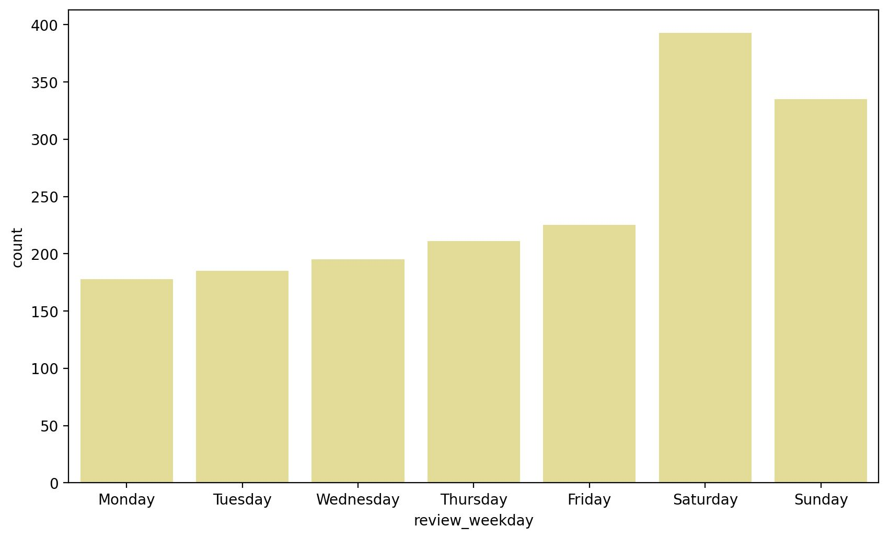
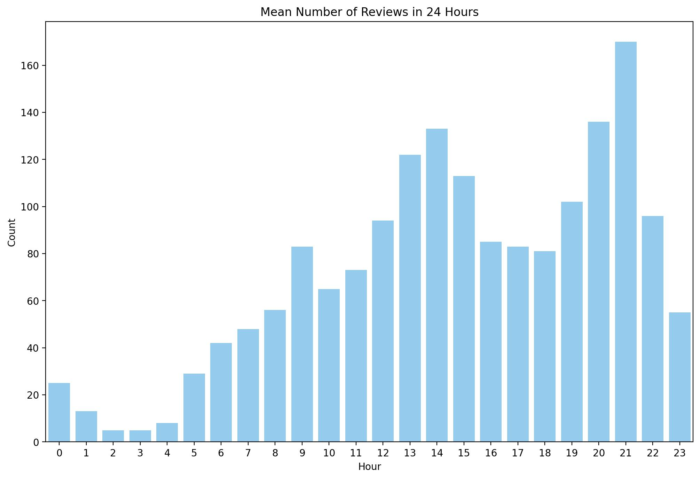

# Google-Reviews-Restaurant-Analysis Repository

## Introduction

This is the first Data Science project I created on my own. The idea for the project is to analyze Google reviews of a restaurant I have been to when I was in Barcelona last winter. Despite having decent reviews (the score was 4.4 if I remember correctly) the food was terrible. It was hard to believe that customers would give good reviews to this place, so I wanted to see if I could find hints of manipulated reviews. Also it was interesting to know how much information about the business can be obtained through the analysis of the review data. It is important to note that a review is not equal to an actual visit. A review is written some time after a visit and I do not have any data regarding time intervals between a visit and review or a percentage of reviews per visit. The latter can also vary depending on the rating.

The goals of the project are as follows.

- Work with real data to answer an interesting question that I personally care about
- Showcase what I've learned so far in the following areas.
  - Python basics (functions, lists, loops, conditions, list comprehension, datetime objects,import csv files etc.)
  - Exploratory Data Analysis with Pandas, Pyplot and Seaborn (feature engineering, data visualization)
  - Natural language processing with NLTK
  - Jupyter Notebook (on Windows using Ubuntu on WSL)
  - Git and Github
  - I have not focused on formatting of the pictures, the goal is to finish the project quickly to have a project to showcase for applications.

## Obtaining Data

I was looking for the API for Google reviews, but I soon found out that the API allows 5 reviews only. Since I did not want to invest time to learn how to scrape data myself I used the Outscraper service (https://outscraper.com/). With this I was able to get all the reviews for the restaurant in a csv file.

## Inspecting Data

The imported csv file contains all 1722 reviews that were available at this point of time beginning March 2019 until August 2022. It contains different kind of data, most relevant for this project being the actual review data containing review text, and rating, owner answer, likes and timestamps. The there are few nan values for reviews without text and owner answer. After dropping the columns considered irrelevant for this project the dataframe looks as follows.

## Data Analysis

In this section I formulate questions that I will try to answer using visualizations.

What is the distribution of ratings?

How many of the reviews have a text?

For each review rating group (how many stars), how many reviews have text? The easiest way to manipulate reviews would probably be to by five star reviews without text.

Comment: the highest percentage of answers can be found in 3 and 4 star reviews, so no indication for manipulation here.

For each review rating group (how many stars), how many have been answered by the owner?

Comment: the owner answered proportionally mostly to negative (1 and 2) star reviews.

For each review rating group (how many stars), what is the distribution of likes?

Comment: most of the likes have been given to 5 star reviews, but there are some one star reviews with several likes.

What is the highest amount of likes given from all the 1 star reviews? Display the text of this review.

Answer: 8
Test reads as follows (translated by Google).
"DISASTROUS! There were 8 of us and after waiting 1 hour and a half, they forgot our command. When it finally arrived, half the burgers were cold and inedible, and the bread was breaking (reheated) and we had to send them back. The fries were dry, refried, and oily. In addition, they were wrong in the companions. The service was relatively friendly, although the Asian-looking waiter hesitated at my friend and was extremely unprofessional. Whoever takes a lot of space, the less he tightens up!!"

What is the highest amount of likes given from all the 5 star reviews? Display the text of this review.

Answer: 7
Text reads as follows (one of 3 reviews, translated by Google).
"Impressive quantity and quality of burgers! Undoubtedly one of the best hamburger restaurants in Barcelona. I loved the flavor of the meat , with a touch of grilled meat that was not lost despite the extra ingredients and sauces . In addition, the size of the hamburgers is enormous, the quality, quantity and price ratio is very good. The super Cheezy was very good and so that you don't get dirty with all the cheese it has, they give you some gloves to eat it, which is a detail and helps you enjoy it much more. The service very attentive and fast. The spacious place, very well decorated and in full truth. In short, everything is perfect."

For each hour of the day, what is the mean review rating posted?

Comment: the mean rating is distributed more or less evenly for each hour of the day.

For each hour of the day, how many reviews have been posted on average?

Comment: the average amount of reviews per weekday increases steadily from Monday to Friday, takes a step upwards on Saturday and decreases slightly on Sunday. This is about the expected distribution of restaurant visits according to my experience which suggests that the reviews are posted by clients when they are actually in the restaurant.

For each hour of the day, how many reviews have been posted on average?

Comment: it can be seen that there are 2 peaks in the hourly distribution of reviews at 14 o'clock and at 21 o'clock. Since these are about the expected distribution of restaurant visits according to my experience this is another hint that the reviews are posted by clients when they are actually in the restaurant. This is a significant piece of information since a restaurant owner can take measures to motivate the customers to write reviews by showing reminders inside the restaurant.

Show the chronological sequence of the review score (rolling mean and cumulated).

Comment: form the graph of the rolling mean it can be seen that the reviews have been rather inconsistent with values ranging from 3.8 and 4.8. It can also be seen that the restaurant had 2 breaks around May 2020 and March 2021. In the graph of cumulative review mean it can be seen that the average rating has been consistently around 4.3, but grew steadily towards 4.4 in the last half a year, which is the most consisted trend from the complete record.

Show the chronological sequence of the mean number of reviews and mean rating per month.

Comment: it can be seen that the mean amount of review per month has been rising slowly from around 30 to around 80 per month except for the ca. 1 year period between the 2 breaks. The mean review rating per month has been consistently around 4.3 (except for the ca. 1 year period between the 2 breaks mentioned above), but has increased to 4.6-4.7 in the last 6 months.

