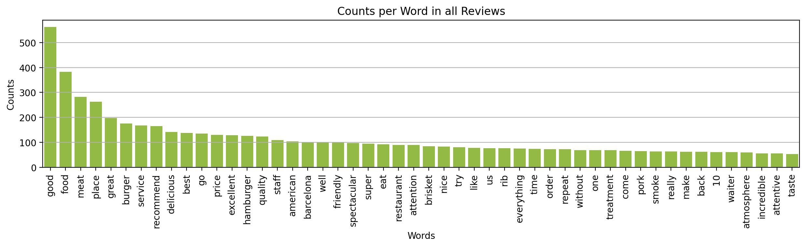

# Google-Reviews-Restaurant-Analysis Repository

## Introduction

This is the first Data Science project I created on my own. The idea for the project is to analyze Google reviews of a restaurant I have been to when I was in Barcelona last winter. Despite having decent reviews (the score was 4.4 if I remember correctly) the food was terrible. It was hard to believe that customers would give good reviews to this place, so I wanted to see if I could find hints of manipulated reviews. There are a lot of discussions regarding the authenticity of Google reviews in general. In addition it was interesting to know how much information about the business can be obtained through the analysis of the review data. It is important to note that a review is not equal to an actual visit. A review is written some time after a visit and I do not have any data regarding time intervals between a visit and review or a percentage of reviews per visit. The latter can also vary depending on the rating.

The goals of the project are as follows.

- Work with real data to answer an interesting question that I personally care about
- Showcase what I've learned so far in the following areas.
  - Python basics (functions, lists, loops, conditions, list comprehension, datetime objects,import csv files etc.)
  - Exploratory Data Analysis with Pandas, Pyplot and Seaborn (feature engineering, data visualization)
  - Natural language processing with NLTK
  - Jupyter Notebook (on Windows using Ubuntu on WSL)
  - Git and Github
  - I have not focused on formatting of the pictures, the goal is to finish the project quickly to have a project to showcase for applications.

## Obtaining Data

I was looking for the API for Google reviews, but I soon found out that the API allows 5 reviews only. Since I did not want to invest time to learn how to scrape data myself I used the Outscraper service (https://outscraper.com/). With this I was able to get all the reviews for the restaurant in a csv file.

## Inspecting Data

The imported csv file contains all 1722 reviews that were available at this point of time beginning March 2019 until August 2022. It contains different kind of data, most relevant for this project being the actual review data containing review text, and rating, owner answer, likes and timestamps. The there are few missing values for reviews without text and owner answer. After dropping the columns considered irrelevant for this project the dataframe looks as follows.

## Data Analysis and Visualization

In this section I formulate questions (<em>in italic</em>) that I provide a clear answer using feature engineering (filtering, grouping, etc) and visualizations.

<em>What is the distribution of review scores (1 to 5 star)?</em>

Comment: this simple figure already provides an interesting observation that the amount of reviews given for the neutral score (3 stars) is significantly lower than the strongly negative reviews (1 star). It is not surprising that most reviews are on the positive side since the restaurant has an average score of 4.4 stars (at the time the data has been acquired). The thesis that can be derived from this is that customers are more likely to post a review for very good or very bad experiences. An middle-of-the-road experience possibly does not provide to the customer enough motivation to write a review.

<em>How many of the reviews have a text?</em>

<em>For each review rating group (how many stars), how many reviews have text? The easiest way to manipulate reviews would probably be to post five star reviews without text.</em>

Comment: the highest percentage of answers can be found in 3 and 4 star reviews, so no indication for manipulation can be found here. In general, it can be stated that the owner has put a significant effort in answering the reviews.

<em>For each review rating group (how many stars), how many have been answered by the owner?</em>

Comment: the owner answered proportionally mostly to negative (1 and 2) star reviews.

<em>For each review score (how many stars), what is the distribution of review likes? The number of likes is a measure for how helpful a review is and may be used by the owner to boost the positive reviews</em>

Comment: most of the likes have been given to 5 star reviews, but there are some one star reviews with several likes. Also here no hint for manipulation can be found.

<em>What is the highest amount of likes given from all the 1 star reviews? Display the text of this review.</em>

Answer: 8. The text reads as follows (translated by Google).
"DISASTROUS! There were 8 of us and after waiting 1 hour and a half, they forgot our command. When it finally arrived, half the burgers were cold and inedible, and the bread was breaking (reheated) and we had to send them back. The fries were dry, refried, and oily. In addition, they were wrong in the companions. The service was relatively friendly, although the Asian-looking waiter hesitated at my friend and was extremely unprofessional. Whoever takes a lot of space, the less he tightens up!!"

<em>What is the highest amount of likes given from all the 5 star reviews? Display the text of this review.</em>

Answer: 7. The text reads as follows (one of 3 reviews, translated by Google).
"Impressive quantity and quality of burgers! Undoubtedly one of the best hamburger restaurants in Barcelona. I loved the flavor of the meat , with a touch of grilled meat that was not lost despite the extra ingredients and sauces . In addition, the size of the hamburgers is enormous, the quality, quantity and price ratio is very good. The super Cheezy was very good and so that you don't get dirty with all the cheese it has, they give you some gloves to eat it, which is a detail and helps you enjoy it much more. The service very attentive and fast. The spacious place, very well decorated and in full truth. In short, everything is perfect."

<em>For each hour of the day, what is the mean review rating posted?An aggregation of positive reviews on a certain time of a day could a hint for manipulation.</em>

Comment: the mean rating is distributed more or less evenly for each hour of the day, no irregularities can be found.

<em>For each day of week, how many reviews have been posted on average? </em>

Comment: the average amount of reviews per day of week increases steadily from Monday to Friday, takes a step upwards on Saturday and decreases slightly on Sunday. This is about the expected distribution of restaurant visits according to my experience which suggests that the reviews are posted by clients when they are actually in the restaurant. However: on Mondays and Tuesdays the restaurant is closed (at the time when data was obtained). The figure below shows review counts on Mondays for the complete dataset. It can be seen that the reviews has been posted more or less consistently, so there has apparently been no change in opening days throughout the dataset. Same applies for Tuesdays (not shown here). This contradicts the suggestion below that states that the reviews are written when the customers are in the restaurant. There seems to be a quite small variation in review score throughout the week, actually Tuesday has the worst reviews of the week. Therefore, no hints for manipulation could be found here.

<em>For each hour of the day, how many reviews have been posted on average and what is the average score?</em>

Comment: it can be seen that there are 2 peaks in the hourly count of reviews at 14 o'clock and at 21 o'clock. The opening hours at the time of data acquisition are 13:00-17:00 and 20:00-00:00. So here again, even if the opening hours have changed throughout the dataset, a huge portion of reviews still has been posted outside of the opening hours. There is a remarkable increase in mean score between 1-2 a.m. and 7 a.m., but nothing that can have a significant impact on the overall score.

<em>Show the chronological sequence of the mean number of reviews and mean rating per month.</em>

Comment: it can be seen that the mean amount of review per month has been rising slowly from around 30 to around 80 per month except for the ca. 1 year period between the two breaks suggesting there have been Covid restrictions. The mean review rating per month has been consistently around 4.3 (except for the ca. 1 year period between the two breaks mentioned above), but has increased to 4.6-4.7 in the last 6 months.

<em>Show the chronological sequence of the review score (rolling mean and cumulated).</em>

Comment: form the graph of the rolling mean score it can be seen that the reviews have been rather inconsistent with values ranging from 3.8 and 4.8. The two breaks around May 2020 and March 2021 mentioned above are also present. In the graph of cumulative review mean it can be seen that the average rating has been consistently around 4.3, but grew steadily towards 4.4 in the last half a year.

## Natural Language Processing

In this section I have used some NLP tools I have learned so far to explore the review text with the NLTK library. The workflow I used for the speech processing is as follows.

<ol>
  <li>Drop columns that are not needed (only review text and rating )
  <li>Remove all reviews that do not have a review text from the dataframe</li>
  <li>Split reviews in single words</li>
  <li>Remove punctuation</li>
  <li>Remove Google translation remarks (some reviews are not in English and have been translated by Google) as well as text in original language</li>
  <li>Remove stopwords</li>
  <li>Part-of-speech (pos) tagging</li>
  <li>Lemmatize words</li>
  <li>Analyze text (repeated words, concordance, bigrams, trigrams, sentiment analysis)</li>
</ol>

The dataframe for NLP looks as follows.

The first step of processing is removing punctuation as well as the Google Translate text and the text in the original language.

One interesting measure to look at after cleaning the text is the review length. The histogram below shows the review counts per review length class. It can be seen that most reviews are about 270 words long. There is also a huge outlier with over 300 words. As seen in the plot of the cumulative distribution, roughly 95% of all words written in all reviews have less than 50 words.

The next step that is preformed pos tagging followed by lemmatization. This allows to reduce the number of different words in the text having the same lemma or dictionary form respectively. The actual transformation of words with the same lemma is done with a function that translates the pos tags returned by the WordNetLemmatizer function from the NLTK module as follows. I used a piece of code from the following source: https://www.holisticseo.digital/python-seo/nltk/lemmatize.

- JJ (Adjective),JJR (Adjective, comparative), JJS (Adjective, superlative) => adjective
- NN (Noun, singular or mass), NNS (Noun, plural), NNP (Proper noun, singular), NNPS (Proper noun, plural) => noun
- RB (Adverb), RBR (Adverb, comparative), RBS (Adverb, superlative), RP (Particle) => adverb
- VBD (Verb, past tense), VBG (Verb, gerund or present participle), VBN (Verb, past participle), VBP (Verb, non-3rd person singular present), VBZ (Verb, 3rd person singular present) => verb

After the steps described above have been executed, the distribution of words for 50 most common words in all reviews looks as shown in picture blow. It can be noted that some words are more likely to be useful for the review analysis (good, meat, price, service) and some are less (go, american, try). This may be a subject for further investigation. Also, without a context the information that can be draw out of this is limited. However, this might be useful when comparing different restaurants against each other.

Another way to look at the distribution of words in the reviews is using the dispertion plot. This is displayed in picture below for the words for six example words. This visualization allows to display the frequency of words as well as their position in the text.

With the NLTK module it is also possible to find bi- and trigrams in the text, results are shown in the picture below.

The last NLP tool I present in this document this project is the Sentiment Text Classification. This allows to estimate if the text has a positive or negative sentiment. In the case of Google reviews the sentiment is obvious because the review scores are given (assumption: 4 and 5 star reviews are positive, 3 is neutral, 1 and 2 negative). Therefore this offers an opportunity to assess how good this works on real reviews.

For the calculation of sentiment SentimentIntensityAnalyzer() from the NLTK module is used. The 'compound' component of the output of the function is used. The distribution of the mean compound value grouped by review score is shown in the figure below.

The rule defined to translate the sentiment compound value to "bad"/"neutral"/"good" categories is as follows.

- compound score >= 0.05 => positive sentiment
- compound score < 0.05 and compound score > -0.05 => neutral sentiment
- compound score <= -0.05 => negative sentiment

It can be seen the sentiment analysis adheres to the rule above for 1 star reviews as well as 4 and 5 star reviews, the rest in not classified correctly. Nevertheless the compound value grows with increasing score, so in it can be stated that the progression of positivity from 1 to 5 star reviews is assessed correctly.

Using this rule one can assign a category as described below to each review text and group by review score, see figure below.

On this figure it can be seen that the tendency is correct, though the assessment of neutral and good reviews is difficult to tell apart. It can be noted that the assumption that 4 and 5 star reviews are positive, 3 is neutral, 1 and 2 are negative may not be correct.

Another way to visualize the effectivity of the sentiment analysis is to create a violin plot for the compound sentiment distribution for each review score, see picture below.

It can be seen that the most distinctive results are achieved in the 1 and 4/5 star scores, whereas the 2 and 3 star scores are less distinctive, as shown above.

## Summary

Work in progress...
